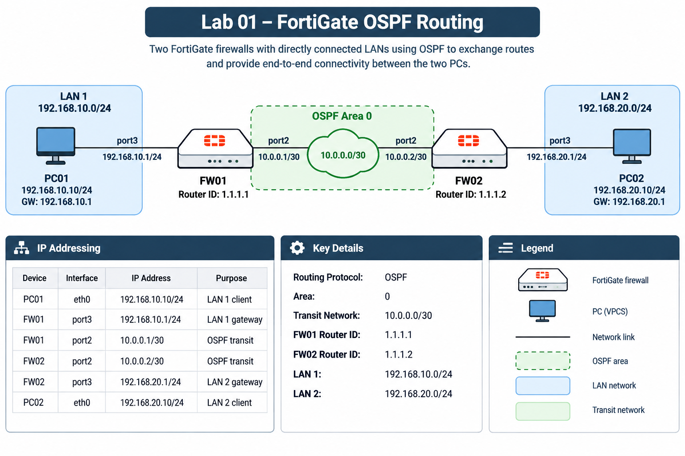

# fortigate-network-labs

# Lab 01 - FortiGate OSPF Routing

## Objective

The objective of this lab was to configure dynamic routing between two FortiGate firewalls using OSPF.

Each FortiGate has a directly connected LAN containing a test PC. OSPF is used between the FortiGates to advertise the LAN networks and provide end-to-end connectivity between the two PCs.

## Topology

## IP Addressing

| Device | Interface | IP Address | Purpose |
|---|---|---|---|
| PC01 | eth0 | 192.168.10.10/24 | LAN 1 client |
| FW01 | port3 | 192.168.10.1/24 | LAN 1 gateway |
| FW01 | port2 | 10.0.0.1/30 | OSPF transit |
| FW02 | port2 | 10.0.0.2/30 | OSPF transit |
| FW02 | port3 | 192.168.20.1/24 | LAN 2 gateway |
| PC02 | eth0 | 192.168.20.10/24 | LAN 2 client |

## Routing

OSPF Area 0 was configured between FW01 and FW02.

The 192.168.10.0/24 and 192.168.20.0/24 networks are dynamically advertised rather than using static routes.

Verification included:

- OSPF neighbour adjacency reaching FULL state
- Remote LAN networks appearing as OSPF routes
- End-to-end connectivity between PC01 and PC02

## Firewall Policies

Firewall policies were required to permit traffic between the LAN and OSPF transit interfaces.

For traffic initiated from PC01 towards PC02:

- FW01: port3 → port2
- FW02: port2 → port3

NAT is not required because both networks are internally routed and each FortiGate has a route to the remote subnet.

## Troubleshooting

### Firewall policy direction

One issue encountered was an incorrectly configured policy on FW02.

Both FortiGates initially had a port3 → port2 policy. However, traffic arriving at FW02 from FW01 enters on port2 and exits towards PC02 on port3.

Changing the FW02 policy to port2 → port3 restored end-to-end connectivity.

### FortiGate VM licensing

The original Fortinet VM image was not correctly licensed. Routing protocols such as OSPF were operational, but transit traffic was not being forwarded through firewall policies.

The lab was rebuilt using FortiGate VM 7.6.7 with valid evaluation licensing.

This was useful for demonstrating the difference between traffic generated by the FortiGate itself and traffic being forwarded through the firewall.

## Verification Commands

OSPF neighbours:

    get router info ospf neighbor

Routing table:

    get router info routing-table all

OSPF routes:

    get router info routing-table ospf

Packet capture:

    diagnose sniffer packet any 'icmp' 4 0 l

Debug flow:

    diagnose debug reset
    diagnose debug flow filter saddr <source-ip>
    diagnose debug flow filter daddr <destination-ip>
    diagnose debug flow show function-name enable
    diagnose debug enable
    diagnose debug flow trace start 10

Stop debugging:

    diagnose debug disable
    diagnose debug reset

## Result

PC01 and PC02 successfully communicate across the two FortiGate firewalls using routes dynamically learned through OSPF.

